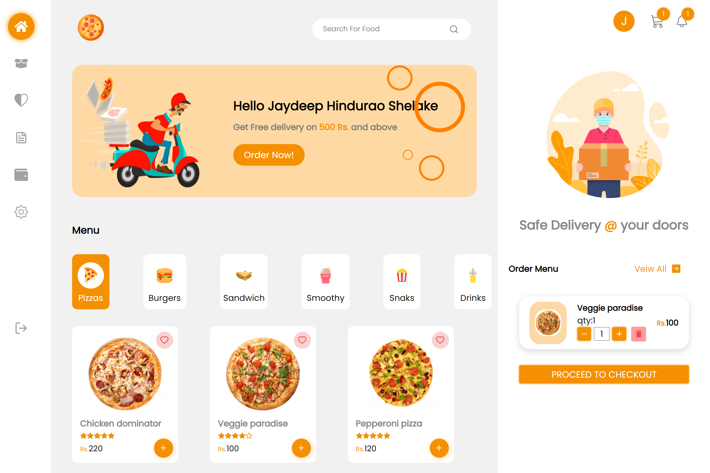

# Food Delivery

### Live Site :

https://foodiefirst.netlify.app/

 

## Detailed Functionality

- Users have to authenticate themselves by Email
- User can add carts items to cart
- Users can update quantity delete the item
- User can check the summary of ordre like items price ,delivery price and total
- User can select COD or online (Razorpay) payment for order
- After Placing order user will redirect to ordere details page and recives an email of order
- User can view there old orders and profile
- User can add , edit or delete address while checkout

## 🚀 Tech and Tools Used

- React.JS ,Redux ,NodeJS ,ExpressJs,MongoDB
- VS code,Heruko
- React Icons,REST APIS ,JWT ,GoogleAPIs,Yup

## 📸 Screenshots

## Home Page

 
